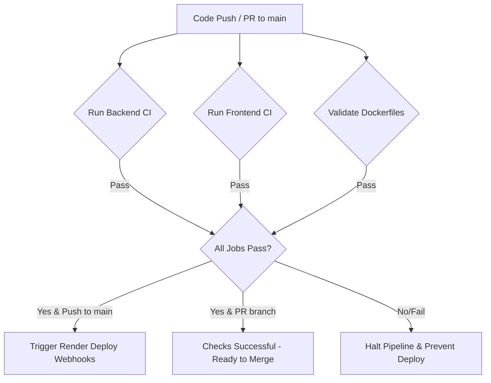

# CI/CD & Deployment Automation Guide

This guide details the setup and operations for the automated **GitHub Actions** CI/CD pipeline, which automatically builds, tests, validates Docker images, and deploys the application services to Render.

---

## 1. CI/CD Pipeline Overview

The pipeline configuration file is located at `.github/workflows/ci-cd.yml`. It runs automatically under the following conditions:
*   **Triggers**: Any code push or merged pull request to the `main` branch.
*   **Pull Requests**: Runs verification checks on any pull requests targeting the `main` branch (without triggering deployments).

### Pipeline Jobs
1.  **Backend CI (`backend-ci`)**: Sets up JDK 17, caches Maven libraries, compiles the Spring Boot code, and executes the JUnit 5 test suite (`mvn clean test`).
2.  **Frontend CI (`frontend-ci`)**: Sets up Node 18, caches NPM modules, installs clean dependencies (`npm ci`), and verifies static pages compilation (`npm run build`).
3.  **Docker Image Validation (`docker-validation`)**: Compiles both `backend/Dockerfile` and `frontend/Dockerfile` inside the GitHub Action runner (using Docker Buildx) to guarantee container build integrities before deploying.
4.  **Deploy to Render (`deploy`)**: Triggers deployments via Render webhook URLs only if all build/test jobs pass and code is pushed to `main`.

---

## 2. Setting Up Automated Deployments

To connect GitHub Actions to Render, you must configure deploy webhooks:

### Step 1: Obtain Deploy Hook URLs from Render
1.  Log in to the [Render Dashboard](https://dashboard.render.com/).
2.  Go to the **amrutha-chicken-backend** web service.
3.  Scroll down to the **Deploy Hook** section in the settings tab and copy the unique URL (e.g., `https://api.render.com/deploy/srv-xxxxxxxxxxxx?key=yyyyyyyyyy`).
4.  Repeat the same step for the **amrutha-chicken-frontend** web service.

### Step 2: Configure Secrets in GitHub
1.  Go to your GitHub repository: `https://github.com/Sampath2910/Amrutha-Chicken-center`.
2.  Click the **Settings** tab.
3.  In the left sidebar, navigate to **Secrets and variables** -> **Actions**.
4.  Click **New repository secret** and create the following keys:
    *   **Name**: `RENDER_BACKEND_DEPLOY_HOOK`
    *   **Value**: Paste the deploy hook URL copied from the backend service.
    *   **Name**: `RENDER_FRONTEND_DEPLOY_HOOK`
    *   **Value**: Paste the deploy hook URL copied from the frontend service.

---

## 3. Monitoring & Troubleshooting

### Pipeline Status Check
*   Monitor pipeline execution under the **Actions** tab of your GitHub repository.
*   Green checkmarks represent successful stages; red cross symbols indicate failures.

### Pipeline Failures
If a test fails, or the Docker images do not compile:
*   The deployment stage is automatically blocked, preserving the active stable build on Render.
*   Review runner log outputs under the failing step to locate syntax errors, dependency mismatches, or test assertions failures.
