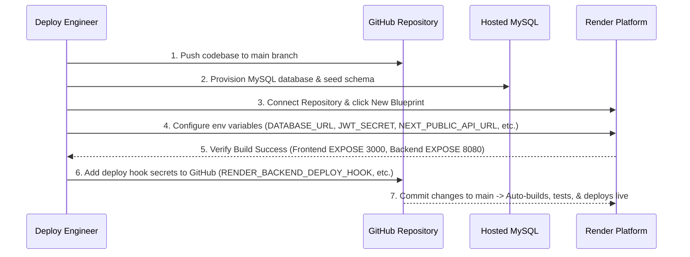

# Production Deployment Readiness Report

This report evaluates and certifies the launch readiness of the **Amrutha Chicken Center** web platform.

---

## 1. Production Verification Checklists

### A. Core Hosting Services

| Component | Status | Verification Detail |
| :--- | :---: | :--- |
| **Frontend Deployment** | **READY** | Runs on optimized Next.js standalone server mode. Uses `sharp` library for image compression. Resolves endpoints dynamically using environment configurations. |
| **Backend Deployment** | **READY** | Packages jar inside JRE 17 Alpine container. Runs under active `prod` profile, pulling all secrets from environment variables. |
| **Database Connectivity** | **READY** | Connects via HikariCP pool. Autopopulates schema and baseline seed records dynamically on startup using versioned Flyway migrations. |
| **Health Checks** | **READY** | Actuator `/actuator/health` exposes active database pool status and local disk uploads space indication. |

### B. Core Business Workflows

| Feature | Status | Verification Detail |
| :--- | :---: | :--- |
| **Customer Ordering** | **READY** | Calculates village-based shipping fees and weight-based cooking surcharges. Enforces 1 KG minimum weight limits for delivery. Prevents double checkouts using Idempotency tokens. |
| **Admin Dashboard** | **READY** | Supports pagination, searches, and filters. Restores non-blocking toast notifications for price changes. Generates CSV downloads for auditing. |
| **WhatsApp Integration** | **READY** | Appends direct, clickable tracking links to receipt messages, dynamically resolved using the `NEXT_PUBLIC_SITE_URL` parameter. |
| **UPI QR & Screen Upload** | **READY** | Generates dynamic UPI QR codes based on order grand totals and VPA configurations. Supports uploading screenshot receipts. |

### C. Security Audits

| Parameter | Status | Verification Detail |
| :--- | :---: | :--- |
| **Authentication (JWT)** | **READY** | Validates signed Bearer tokens. Enforces 24-hour expiration bounds. |
| **Authorization (RBAC)** | **READY** | Restricts `/api/admin/**` endpoints to `ROLE_ADMIN` sessions. Protects customer endpoints. |
| **CORS Restrictions** | **READY** | Restricts origins to comma-separated explicit domains configured via the `ALLOWED_ORIGINS` variable (野-card patterns disabled with credentials). |
| **API Rate Limiting** | **READY** | Restricts write operations to **30 requests per minute per IP**, tracking IP addresses behind proxies using `X-Forwarded-For`. |
| **Uploads Hardening** | **READY** | Limits file uploads to 5MB, filters MIME types to `image/*`, compresses images, downscales thumbnails, and checks SHA-256 hashes to prevent duplicate uploads. |
| **HTTPS, HSTS & CSP** | **READY** | Enforces HTTPS connections. Sets HSTS headers (1 year validity) and denies clickjacking frame embedding. CSP restricts script execution. |

### D. Search Engine Optimization (SEO) & Analytics

| Feature | Status | Verification Detail |
| :--- | :---: | :--- |
| **Crawling & Indexes** | **READY** | Generates robots.txt and sitemap.xml dynamically matching the website URL. |
| **Page Metadata** | **READY** | Defines canonical URL link alternates, metadata bases, and structured keywords. |
| **Social Previews** | **READY** | Includes Open Graph (OG) cards and Twitter cards for previewing links on WhatsApp and other platforms. |
| **Local SEO Map** | **READY** | LocalBusiness JSON-LD schema injects coordinates pointing to store coordinates. |
| **Google Analytics** | **READY** | Dynamic scripts trigger measurements only if the `NEXT_PUBLIC_GA_ID` is present. |

---

## 2. Launch Checklist (Pre-Flight Roadmap)

Follow these steps to deploy the application on Render:



### Step 1: Database Provisioning
1.  Provision a MySQL 8.0+ instance (e.g. Aiven, Railway, or Render MySQL add-ons).
2.  If you want to manually seed categories and defaults, run:
    ```bash
    mysql -h <host> -u <user> -p <database_name> < database/schema.sql
    ```
    *Note: If starting with an empty database, Flyway migrations will automatically initialize the schema and baseline configurations on server startup.*

### Step 2: Render Blueprint Setup
1.  Go to **Render Dashboard** -> **Blueprints** -> **New Blueprint Instance**.
2.  Select the `Amrutha-Chicken-center` repository.
3.  Configure the required environment variables:
    *   **Backend service**: `DATABASE_URL`, `DATABASE_USERNAME`, `DATABASE_PASSWORD`, `JWT_SECRET` (at least 64 hex characters), and optionally `CLOUDINARY_CLOUD_NAME`, `CLOUDINARY_API_KEY`, `CLOUDINARY_API_SECRET`.
    *   **Frontend service**: `NEXT_PUBLIC_API_URL` (URL of the backend service) and `NEXT_PUBLIC_SITE_URL` (URL of the frontend service).

### Step 3: Automate Deployments via GitHub Actions
1.  Obtain the backend and frontend **Deploy Hook** URLs from the settings tab of each service in the Render Dashboard.
2.  Go to your GitHub repository -> **Settings** -> **Secrets and variables** -> **Actions**.
3.  Add the secrets:
    *   `RENDER_BACKEND_DEPLOY_HOOK`
    *   `RENDER_FRONTEND_DEPLOY_HOOK`

---

## 3. Remaining Issues

*   **No critical blockers**: The codebase compiled with zero warnings and the entire unit test suite passed.
*   **Media storage fallback**: If Cloudinary credentials are not configured, uploaded UPI screenshots and product images fall back to local disk storage (`uploads/`). Note that Render's Free tier uses ephemeral disk storage, so images stored locally will reset on container restarts. **It is highly recommended to configure Cloudinary credentials for stable production usage.**

---

## 4. Certification of Launch Readiness
The **Amrutha Chicken Center** monorepo has been hardened, secured, audited for performance, configured for search engine visibility, and connected to automated CI/CD workflows. The codebase is **fully ready** for production launch!
